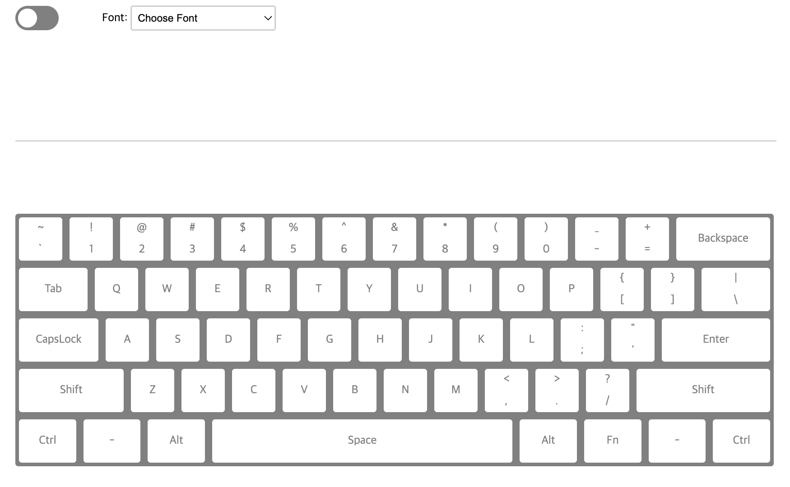
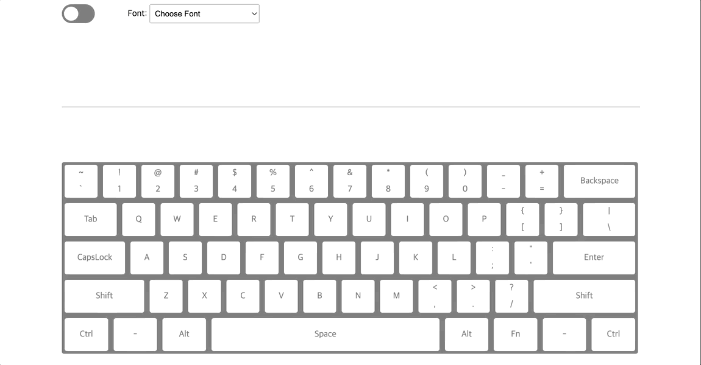
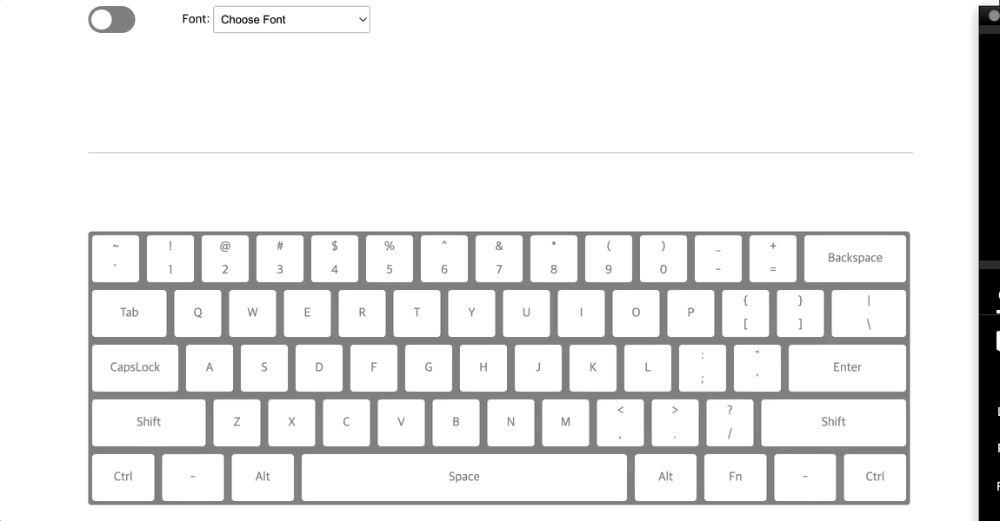
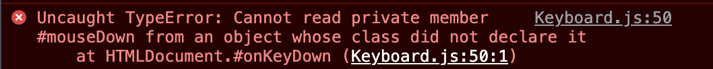

<h1 align="center">가상 키보드</h1>



## Script

```
# node version 14.18.1

$npm install
$npm run dev
```

</br>

## 주요 기능 및 구현

### Keyboard 클래스를 통해 관리

```js
class Keyboard {
  /* 각 요소를 지정할 private(#) 선언 */
  #변수명;

  constructor() {
    this.#assignElement();
    this.#addEvent();
  }

  #assignElement() {
    /* private field의 변수에 Element 할당 */
    #변수명 = document.querySelector(id or 클래스);
  }

  #addEvent() {
    /* 이벤트 부여 */
    #변수명.addEventListner('속성', 콜백)
  }
}
```

### 다크 모드 및 폰트 변경


- `Element.setAttribute()` 속성 이용
- <b>CSS</b>
  ```css
  html[theme='dark-mode'] {
    ...;
  }
  ```
- <b>JS</b>
  - 다크모드 : 상단 스위치 클릭 시 html 문서에 `theme = 'dark-mode'` 토글 기능 부여
  - 폰트 : `document.body.style.fontFamily = 셀렉트 태그 값`

### 키보드 입력



- <b>입력 애니메이션</b>
  - `onKeyDown` 이벤트 발생 시 해당 키에 class 부여
  - `onKeyUp` 이벤트 발생 시 해당 키에 class 제거
- <b>한글 입력 불가</b>
  - `/[ㄱ-ㅎ|ㅏ-ㅣ|가-힣]/.test(value)` 정규 표현식 사용

### 마우스 입력



- <b>키보드 마우스 동시 입력 불가</b>
  - `#keyPress`, `#mouseDown` 각 변수를 두어 관리

## 추가

### 이벤트 바인딩 (this)

```js
class Keyboard {
  #변수;
  #변수2;

  constructor() {
    this.#assignElement();
    this.#addEvent();
  }

  #assignElement() {
    /* private field의 변수에 Element 할당 */
    #변수 = document.querySelector(id);

  }

  #addEvent() {
    #변수.addEventListener('keydown', this.#이벤트함수); // 오류
    #변수.addEventListener('keydown', this.#이벤트함수.bind(this)); // 정상 작동!
  }

  #이벤트함수(event) {
    /* 내부에서 this 사용 시 */
    this.#변수2 ...
  }
}
```

`#이벤트함수`는 일반 함수로 호출되기 때문에 내부에서 this를 사용할 경우 <b>this는 전역 객체(global, window)를 가리키게 된다.</b> 이럴 경우 전역 객체에는 `#변수(#mouseDown)` 가 존재하지 않기 때문에 오류가 발생할 수 있다. 

따라서 `bind` 를 통해 this를 명시적으로 `Keyboard 클래스`로 지정해준다.

### event

- <b>이벤트 버블링</b>
  - 한 요소에 이벤트가 발생하면, 이 요소에 할당된 핸들러가 동작하고, 이어서 부모 요소의 핸들러가 동작한다. 가장 최상단의 조상 요소를 만날 때까지 이 과정이 반복되면서 요소 각각에 할당된 핸들러가 동작한다.
- <b>event.target vs event.currentTarget</b>
  - `event.target` : 이벤트가 발생한(실제 이벤트가 시작된) 가장 안쪽의 요소를 가리킴
  - `event.currentTarget` : 현재 실행 중인 이벤트 핸들러가 할당된 요소를 가리킴

### `<label>`
- 사용자 인터페이스(UI) 요소의 라벨(label)을 정의할 때 사용
- for 속성을 사용하여 다른 요소와 결합 가능
- for 속성은 결합하고자 하는 요소의 id 속성값과 같아야 함
- 명시적, 암시적 두 가지 방법 존재

```html
// 명시적
<form>
    <input type="radio" name="ages" id="teen" value="teenage">
    <label for="teen">10대</label><br>
    <input type="radio" name="ages" id="twenty" value="twenties">
    <label for="twenty">20대</label><br>
    <input type="radio" name="ages" id="thirty" value="thirties">
    <label for="thirty">30대</label><br>
    <input type="radio" name="ages" id="forty" value="forties">
    <label for="forty">40대 이상</label><br>
    <input type="submit">
</form>

// 암시적
<label>
	<input type="checkbox" />
</label>
```