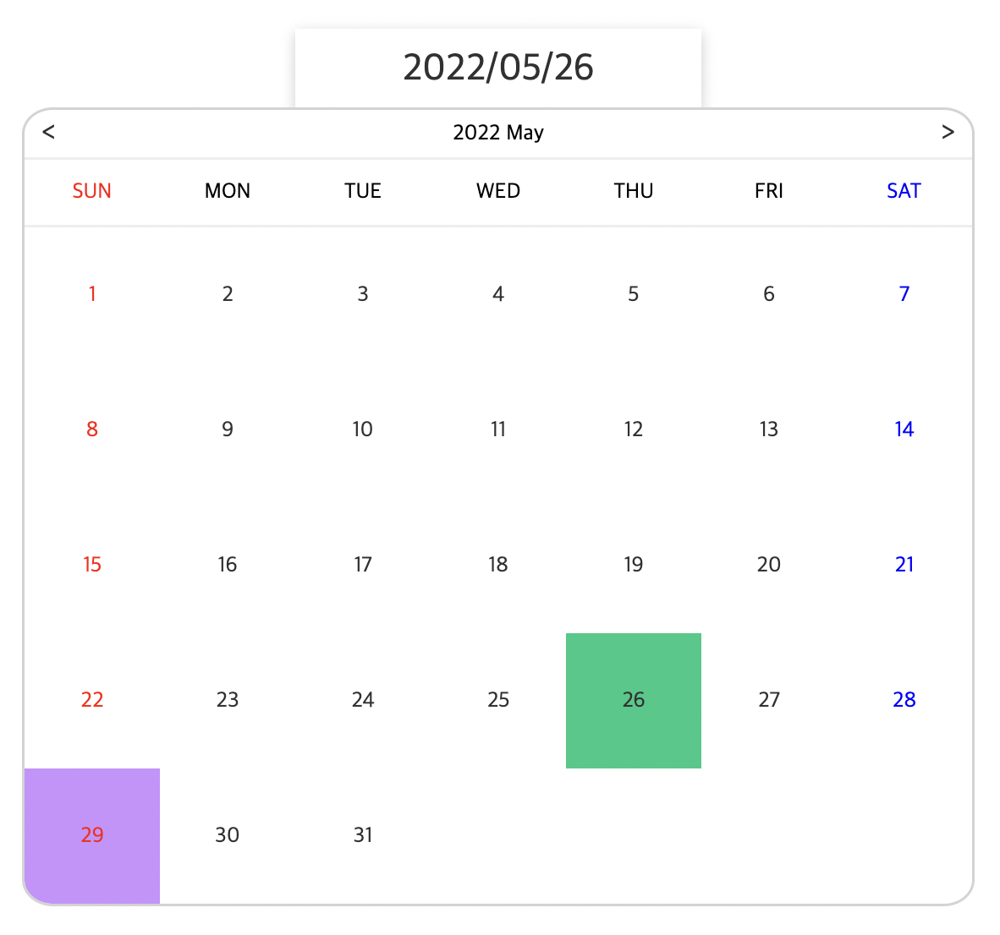
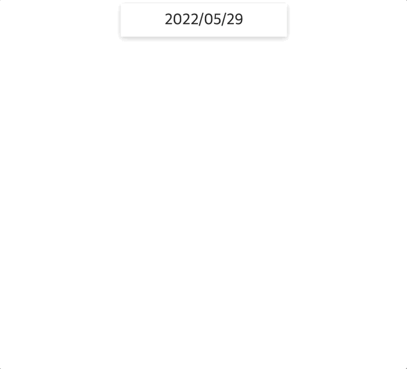
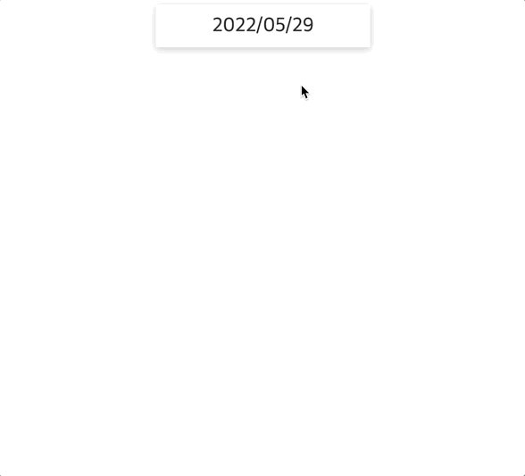

<h1 align="center">Date Picker</h1>

## 주요 기능 및  구현

### 레이아웃

### 날짜 조회 기능

- <b>`new Date()`</b>
  - .getDate(), .getFullYear(), .getMonth(), .getDay() 메서드 사용
  - getMonth의 경우 1~12가 아닌 0~11로 값이 나옴
  - getDay의 경우 0~6 (일, 월, 화, 수, 목, 금, 토)

- dataset
  - getDate를 통헤 해당 달의 총 일수를 구한 후 for문을 통해 각 일에 dataset 적용
  - html: data-속성
  - js: element.dataset.속성

- Grid
  - `new Date(년, 월, 1).getDay() + 1`를 통해 <b>grid-column-start</b> 를 지정해줌으로써 달력의 시작점을 구현

- 토, 일
  - 토: nth-child(7n + (7 - `new Date(년, 월, 1).getDay() + 1`))
  - 일: nth-child(7n + (8 - `new Date(년, 월, 1).getDay() + 1`) % 7)

### 날짜 입력 기능

- 이벤트 버블링
  - 날짜가 포함된 컨테이너에 이벤트 바인딩
  - 클릭 시 eventTarget에 dataset.date속성이 있을 경우를 판단후, 해당 날짜에 클래스 적용 및 기존 

- 
- 배운점
  - 데이터 관리
    - #calendarDate : 달력 정보
    - selectedDate : 선택한 날짜 정보
  - 날짜 인풋 클릭 시 달력이 토글되는데, 다시 달력이 렌더링 될때 현재(선택한) 날짜로 달력을 보여주는 구현 과정에서 너무나 당연하게 달력이 열릴 때, 이동하는 것으로 생각했었다. 그러나 그 반대로 달력이 닫힐 때 미리 달력 정보를 변경했다. 이를 통해서 좀더 ui/ux적으로 자연스러운? 결과물을 보여줄 수 있겠다는 생각이 들었다.

### 추가
> snowpack
>
> 기존 Webpack, Rollup, Parcel 같은 번들러와 달리, 간단하고 가벼워 번들 소요시간을 획기적으로 절약할 수 있다.
> 웹 빌드 시스템에 대한 새로운 접근 방식 `Javascript의 ES Module`을 이용하여, 동일 파일을 다시 빌드하지 않고, 변경사항을 브라우저에 즉시 적용할 수 있다.
