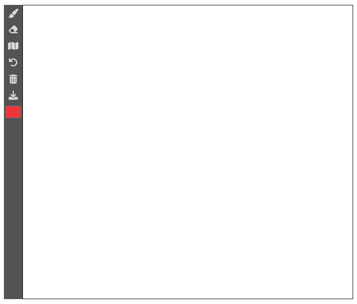
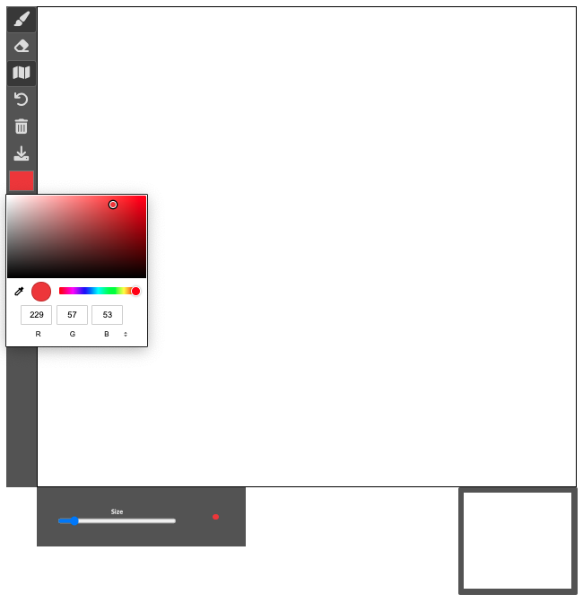
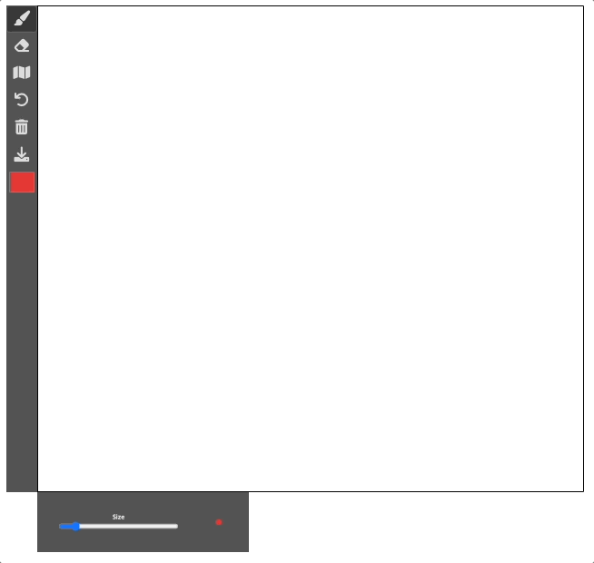
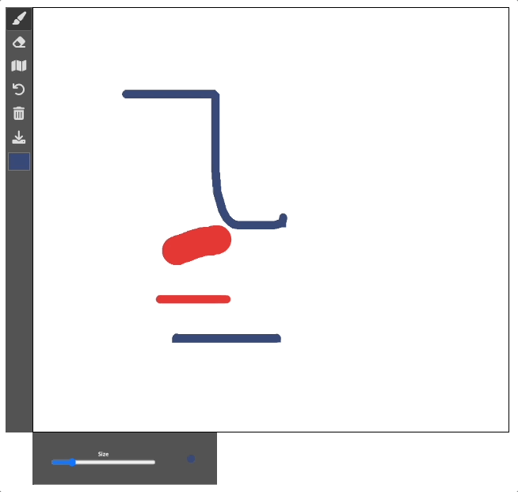
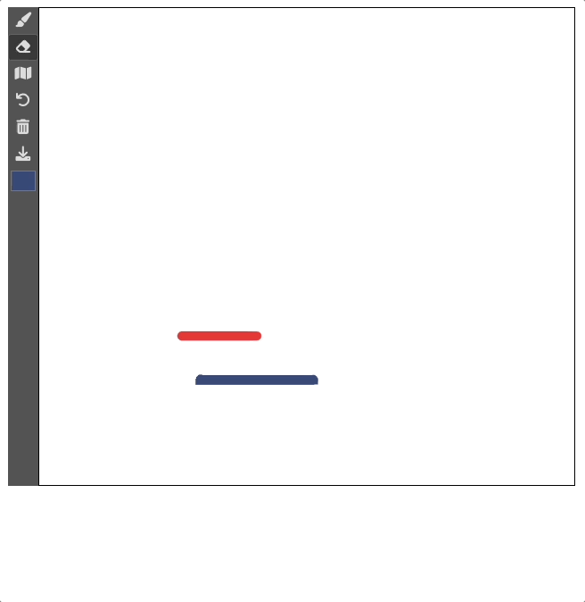
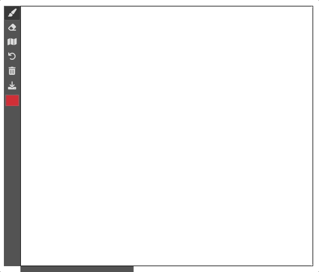
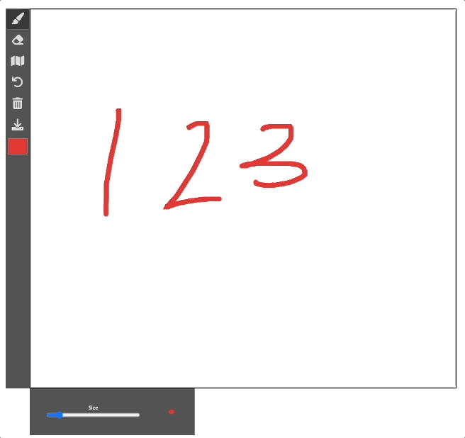
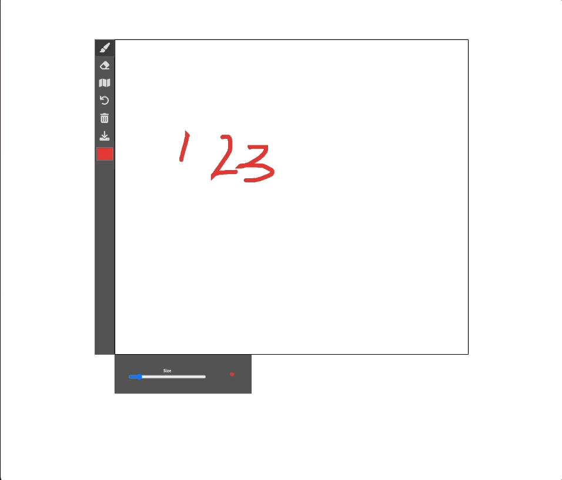

<h1 align="center">Drawing Board</h1>
<p align="center"></p>

## 주요 기능 및  구현
- [선 그리기](#선-그리기)
- [지우개](#지우개-기능)
- [내비게이터](#지우개-기능)
- [실행 취소](#실행-취소-기능)
- [초기화](#초기화-기능)
- [다운로드](#다운로드-기능)

### parcel
> parcel을 사용하면 별도의 설정 없이 간단히 모듈을 사용할 수 있어 편리하다.

```shell
npm install -D parcel-bundler -D
```
- `parcel build --public-url ./` : (배포 전) html 파일 기준으로 상대경로를 찾을 수 있다.

### 레이아웃


- `<input type="range">`
  - 선 굵기를 조절하는 UI로 이용
  - 기본 범위는 0부터 100까지이지만, 다음 속성들과 함께 사용하면 그 범위를 설정할 수 있다.
    - max : 최댓값을 명시함.
    - min : 최솟값을 명시함.
    - step : 요소에 입력할 수 있는 숫자들 사이의 간격을 명시함.
    - value : 요소의 초깃값을 명시함.

- `<input type="color">`
  - 선의 색상을 조절하는 UI로 이용

- `<canvas>`
  - width, height를 태그에 직접 넣는걸 권장
  - ```js
    const canvas = document.getElementById('canvas id값');
    const context = canvas.getContext('2d');

    => context를 추출해낸 후 다양한 canvas api를 사용하여 작업할 수 있다.
    ```

### 선 그리기

- MODE: 'BRUSH'
- `IsMouseDown` 변수를 두어 사용자가 어떤 상태인지를 파악한다.
- 현재 마우스 위치
  - ```js
      getMousePosition(event) {
        const boundaries = this.canvasEl.getBoundingClientRect();
        return {
          x: event.clientX - boundaries.left,
          y: event.clientY - boundaries.top,
        };
      }
    ```
  - 마우스의 위치를 <b>canvas 엘리먼트 내부의 좌표로 초기화</b>하기 위한 구현
- 선의 굵기 / 색상 변경
  - 굵기 : brushSliderEl = `<input type="range">` 의 value 값을 이용
  - 색상 : colorPickerEl = `<input type="color">` 의 value 값을 이용
- 그리기
  - onMouseDown
    - ```js
        context.beginPath(); // 경로는 beginPath() 이후 다음 beginPath()가 호출될 때까지 이어진다.
        context.moveTo(x, y); // 현재 마우스 위치를 기입
        context.lineCap = 'round'; // 선 모양
        context.strokeStyle = colorPickerEl.value; // 선 색상
        context.lineWidth = brushSliderEl.value; // 선 굵기
      ```
  - onMouseMove
    - ```js
        context.lineTo(x, y); // 이동할때 마다 해당 좌표까지 선을 잇는다
        context.stroke(); // 경로에 있는 도형들을 모두 그린다
      ```
  - onMouseUp / onMouseOut
    - 선 그리기 작동 중단

### 지우개 기능

- MODE: 'ERASE'
- onMouseDown 함수 내에서 MODE 에 따라 선 굵기 / 색상(canvas background color와 동일)을 변경

### 내비게이터 기능

- canvas 엘리먼트의 이미지를 `toDataURL` 메서드를 통해 문자열로 변환
- 하단 내비게이터 `` 엘리먼트의 src 속성으로 부여
- ```js
    navigatorImageEl.src = canvasEl.toDataURL();
  ```
- > toDataURL(type, encoderOptions) <br />
  > type: 이미지 포맷 방식 (default: image/png) <br />
  > encoderOptions: 이미지 퀄리티 조절 (0: 최하 ~ 1: 최상)

### 실행 취소 기능

- `undoArray = []`로 canvas 상태를 저장
- onMouseDown 시 이전 canvas 상태를 toDataURL()로 저장
- 사용자가 실행 취소 버튼 클릭 시
  ```js
    // 1. 가장 최근 데이터를 가져온다
    let previousDataURL = undoArray.pop();
    let previousImage = new Image();
    // 2. canvas를 초기화 한다.
    // onload 사용 이유 : 이미지가 완전히 DOM에 셋팅된 후 렌더를 완료하고 싶을 때
    previousImage.onload = () => {
      context.clearRect(0, 0, this.canvasEl.width, this.canvasEl.height);
      context.drawImage(
        previousImage,        // 이미지 객체
        0,                    // 이미지 내에 있는 x 좌표
        0,                    // 이미지 내에 있는 y 좌표
        this.canvasEl.width,  // 이미지 내에 있는 (x , y)를 중심으로 그려질 넓이
        this.canvasEl.height, // 이미지 내에 있는 (x , y)를 중심으로 그려질 높이
        0,                    // 캔버스의 x 좌표
        0,                    // 캔버스의 y 좌표
        this.canvasEl.width,  // 캔버스 위에 그려질 이미지의 넓이
        this.canvasEl.height, // 캔버스 위에 그려질 이미지의 높이
      );
    };
    // 3. 이전 데이터 소스를 재할당
    previousImage.src = previousDataURL;
  ```

### 초기화 기능

- `undoArray` 초기화
- `context.clearRect(0, 0, this.canvasEl.width, this.canvasEl.height);` 로 canvas 초기화

### 다운로드 기능

- ```js
    // downloadLinkEl는 a 태그
    // 1. a 태그의 href 속성에 url 셋팅
    downloadLinkEl.href = canvasEl.toDataURL('image/jpeg', 1);
    // 2. a 태그의 download 속성으로 파일 이름 설정
    downloadLinkEl.download = 'example.jpeg';
  ```
