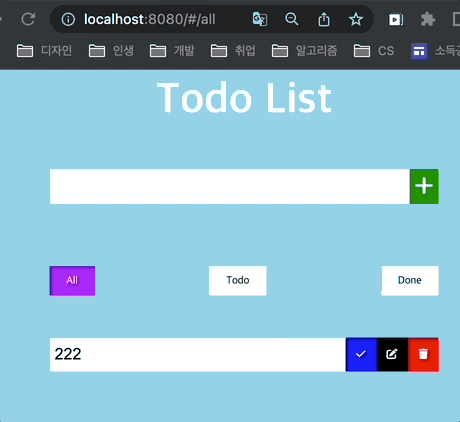

<h1 align="center">To Do List</h1>
<p align="center"></p>

## 주요 기능 및 구현
- [할 일 생성 / 삭제](#할-일-생성--삭제)
- [할 일 수정 / 완료](#할-일-수정--완료)
- [필터](#필터)
- [Router 구현 ❗️](#router-구현)


### RollUp
```shell
npm install -D rollup
npm install -D rollup-plugin-scss sass rollup-plugin-generate-html-template rollup-plugin-livereload rollup-plugin-serve rollup-plugin-terser @rollup/plugin-node-resolve
```
- 자바스크립트 모듈 번들러 중 하나
- <b>여러 모듈(파일)을 한 모듈로 합치면서 ESM 형태로 번들이 가능하다.</b>
- 모듈 간의 import / export 과정이 사라지면서 중복되는 코드가 제거된다. => 용량을 줄일 수 있다.

### 레이아웃
- `<input type="radio">`
  - 여러 개 중 한 개만 선택해야 할 때, 체크박스가 아닌 라디오를 사용

### 버튼
- 버튼 클릭 시 `Element.matches(selectorString)`를 통해 해당 버튼의 타입을 감지

### 할 일 생성 / 삭제

- 생성
  - `input` 의 value를 토대로 todoDiv 생성
  - 생성한 todoDiv의 input은 기본적으로 `readOnly = true`
- 삭제
  - `#delete-btn`을 확인 후, 가장 가까운 `todoDiv`를 찾아 이벤트 실행
  - `document.addEventListener('transitionend', callback);` -> 트랜지션이 끝난 후, 이벤트를 발생시킬 수 있다 (삭제 효과 적용!)

### 할 일 수정 / 완료

- 수정
  - `#edit-btn`을 확인 후, 가장 가까운 `todoDiv`를 찾아 이벤트 실행
  - todoDiv의 input에 `readOnly = false` 부여 및 수정가능한 상태로 변경
- 완료
  - `#save-btn`을 확인 후, 가장 가까운 `todoDiv`를 찾아 이벤트 실행
  - todoDiv의 input에 `readOnly = true` 부여

### 필터

- `document.querySelector`로 모든 todoDiv를 찾아 현재 클릭한 필터값을 토대로 실행한다.
- ```js
    filterTodo(status) {
      const todoDivEls = todoListEl.querySelectorAll('div.todo');

      for (const todoDivEl of todoDivEls) {
        switch (status) {
          case 'ALL':
            todoDivEl.style.display = 'flex'; // 기본 속성 값
            break;
          case 'DONE':
            todoDivEl.style.display = todoDivEl.classList.contains('done') ? 'flex' : 'none';
            break;
          case 'TODO':
            todoDivEl.style.display = todoDivEl.classList.contains('done') ? 'none' : 'flex';
            break;
        }
      }
    }
  ```

### Router 구현

- 기본적으로 URL이 변경 시 http 통신을 통해 해당 정보를 가져온다(축약)
- 하지만 `#(해쉬)`를 사용할 경우 서버에 요청을 보내지 않으며 브라우저에서 다룰 수 있고(히스토리에 쌓인다), 이를 활용한다.
- 해쉬 변경 캐치 방법
  - `window.addEventListener('hashchange', (e) => console.log(e))`
- 해당 라우터에 진입 시, 콜백을 실행하여 필터를 진행
- ALL / TODO / DONE

### 로컬 스토리지에 저장
- 새로고침을 해도 값을 유지하기 위해 사용
- `key: 'todos'`, `value: [{ id, content, status }, ...]` 를 저장
- 저장 시 `JSON.stringify(value)`로 문자열로 변환
- 값을 불러올 시 `JSON.parse(value)`로 객체로 변환

> sessionStorage: 새로고침 시 데이터가 유지되지만, 브라우저를 닫을 경우 사라진다. <br />
> localStorage: 강제로 데이터를 삭제하지 않는 이상 데이터가 남아있다. <br />
>
> [storage종류].메서드 <br />
> setItem(key, value) – 키-값 쌍을 보관한다 <br />
> getItem(key) – 키에 해당하는 값을 받아온다 <br />
> removeItem(key) – 키와 해당 값을 삭제한다 <br />
> clear() – 모든 것을 삭제한다 <br />
> key(index) – 인덱스(index)에 해당하는 키를 받아온다 <br />
> length – 저장된 항목의 개수를 얻는다 <br />

### 추가
- html 파비콘 요청 막기 : `<link rel="shortcut icon" href="data:image/x-icon;," type="image/x-icon"> `
- <b>클래스 내 메서드에서 this를 리턴하면 체이닝을 사용할 수 있다!</b>
  - ```js
      class Router {
        메서드() {
          ...
          return this;
        }
      }

      => Router.메서드().메서드() ...
    ```

