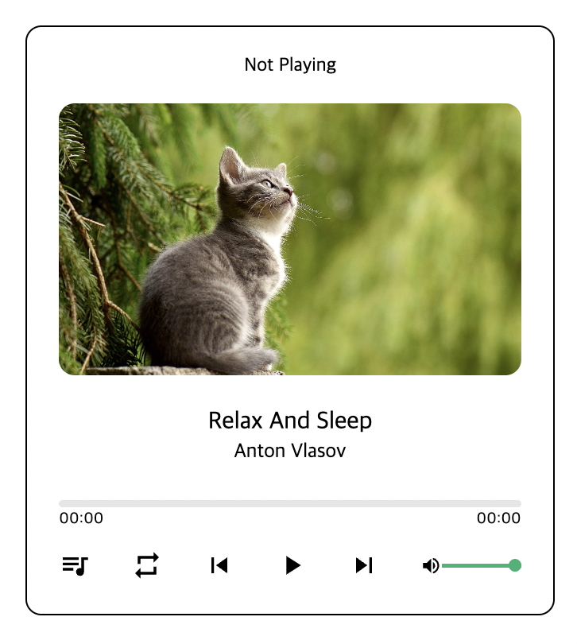
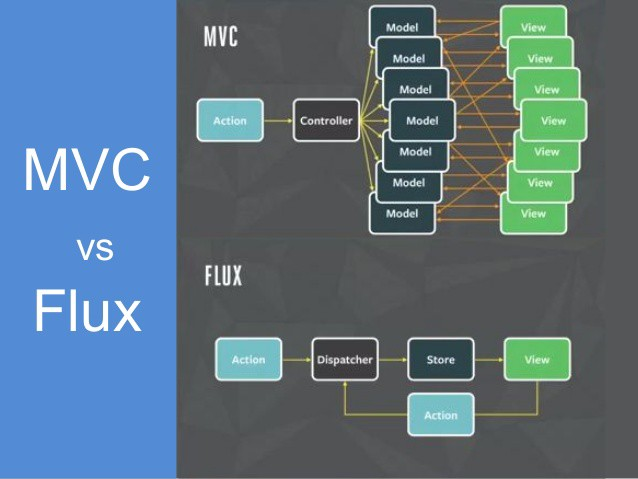
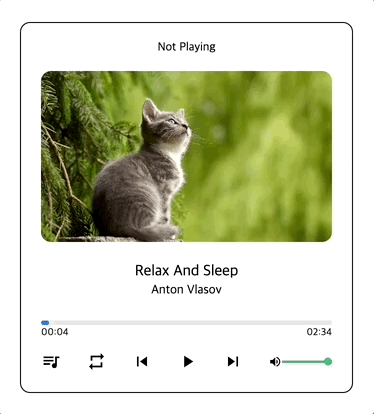

<h1 align="center">Music Player</h1>
<p align="center"></p>

## 주요 기능 및 구현
- [재생, 정지](#재생-정지)
- [프로그레스 바](#프로그레스-바)
- [Volume 조절](#volume-조절)
- [이전 곡, 다음 곡](#이전-곡-다음-곡)
- [랜덤 플레이](#랜덤-플레이)
- [play list 재생시간 구하기](#play-list-재생시간-구하기)

### 폴더 구조
```
src
├── App.js
├── App.scss
├── components
│   ├── Controls              다음 곡, 이전 곡, 재생, 일시정지, 소리 조절 기능
│   │   ├── Controls.jsx
│   │   └── Controls.scss
│   ├── PlayList              뮤직 리스트 중 선택, 순서 변경 기능
│   │   ├── PlayList.jsx
│   │   ├── PlayList.scss
│   │   └── PlayListItem.jsx
│   ├── ProgrssArea           현재 음악 재생 시간 확인, 조절 기능
│   │   ├── ProgressArea.jsx
│   │   └── ProgressArea.scss
│   └── SongDetail            현재 음악 정보
│       ├── SongDetail.jsx
│       └── SongDetail.scss
├── images
│   ├── music-1.jpg
│   ├── music-2.jpg
│   ├── music-3.jpg
│   ├── music-4.jpg
│   └── music-5.jpg
├── index.js
├── index.scss
├── music
│   ├── music-1.mp3
│   ├── music-2.mp3
│   ├── music-3.mp3
│   ├── music-4.mp3
│   └── music-5.mp3
├── store
│   └── musicPlayerReducer.js
└── variables.scss
```

## Redux
> 자바스크립트 상태관리 라이브러리

(React에서) 상태 관리 도구가 필요한 이유
- props 드릴링을 막고, 관심사 분리를 위해

### 특징
<b>Flux 구조</b>



<b>액션 (Action)</b>

```js
const PLAY_MUSIC = 'musicPlayer/PLAY_MUSIC';
const SET_CURRENT_INDEX = 'musicPlayer/SET_CURRENT_INDEX';
```

- 상태에 변화가 필요할 때, 액션을 발생시킨다.
- type을 필수적으로 가져야 하고, 그 외의 값은 자유자재로 다룬다.

<b>액션 생성함수 (Action Creator)</b>

```js
export const playMusic = () => ({ type: PLAY_MUSIC });
export const setCurrentIndex = (index) => ({ type: SET_CURRENT_INDEX , index });
```

- 액션을 만드는 함수
- 파라미터를 받아 데이터 처리를 하는 것은 자유자재
- 액션 생성함수를 만들어서 사용하는 이유는 나중에 컴포넌트에서 더욱 쉽게 액션을 발생시키기 위함

<b>리듀서 (Reducer)</b>

```js
export default function musicPlayerReducer(state = initialState, action) {
  switch(action.type) {
    case PLAY_MUSIC:
      return {
        ...state,
        playing: true,
      }
    ...
    default:
      return state
  }
};
```

- (state, action)을 파라미터로 받아 변화를 일으키는 함수
- 여러개의 리듀서를 만들고 이를 합쳐 `root Reducer`를 만들 수 있다.

<b>스토어 (Store)</b>
- 한 애플리케이션당 하나의 스토어를 만든다.
- 스토어 안에는, 현재의 앱 상태(state)와 리듀서가 들어가있고, 몇가지 내장 함수들이 있다.

<b>디스패치 (Dispatch)</b>

```js
import { useDispatch } from "react-redux";
import { playMusic } from "../../store/musicPlayerReducer";

const Component = () => {
  const dispatch = useDispatch();

  const handlePlayMusic = () => {
    dispatch(playMusic()); === dispatch({ type: PLAY_MUSIC })
  }

  return (
    ...
  )
}
```

- 스토어의 내장함수 중 하나로써, `액션을 발생`시키는 것
- 파라미터로 액션을 전달한다.

<b>구독 (Subscribe) & `useSelector`</b>

```js
  const playing = useSelector((state) => state.playing);
```

- `subscribe` 또한 스토어의 내장함수 중 하나로써, 특정 함수를 파라미터로 전달하면, 액션이 디스패치 되었을때 마다 전달해준 함수가 호출된다.
- 주로 connect 혹은 `useSelector` Hook을 사용하여 리덕스 상태에 구독한다.
  - 객체로 리턴 시, 계속 새로운 객체를 생성하여 리렌더가 되기때문에 최적화가 필요
  1. 각각 가져온다.
  2. 객체로 유지 시 shallowEqual 옵션 사용
    ```js
      const { playList, currentIndex, repeat } = useSelector(state => ({
        playList: state.playList,
        currentIndex: state.currentIndex,
        repeat: state.repeat,
      }), shallowEqual);
    ```
---

### 기본 상태 (Store)
```js
const playList = [{
  ...
},
...
];

const initialState = {
  playList,
  currentMusicId: playList[0].id,
  currentIndex: 0,
  playing: false,
  repeat: "ALL", // ALL, ONE, SHUFFLE
};
```
### 재생, 정지


`<audio>`
- 기존 controls 속성 사용 X
- `useRef`: audio 태그에 접근하여 상태 조절
- `useImperativeHandle`: 다른 컴포넌트에서 메서드를 사용가능하도록 구현
  ```js
    function ProgressArea(props, ref) {
      const audioRef = useRef();

      useImperativeHandle(ref, () => ({
        play: () => {
          audio.current.play();
        },
        pause: () => {
          audio.current.pause();
        },
      }));

      return (
        ...
        <audio ref={audioRef}>
      )
    }

    export default forwardRef(ProgressArea);
  ```
- `audio의 readyState`

|Constant|Value|Description|
|------|---|---|
|HAVE_NOTHING|0|미디어 리소스에 대한 정보가 없는 상태|
|HAVE_METADATA|1|메타 데이터 속성이 초기화 된 충분한 미디어 리소스가 검색된 상태|
|HAVE_CURRENT_DATA|2|현재 재생 위치에 대한 데이터를 사용할 수 있지만 실제로 둘 이상의 프레임을 재생하기에는 충분하지 않는 상태|
|HAVE_FUTURE_DATA|3|현재 재생 위치 및 미래에 약간의 시간 동안 이용 가능한 상태 (적어도 2 개의 비디오 프레임)|
|HAVE_ENOUGH_DATA|4|미디어를 중단없이 끝까지 재생할 수 있을만큼 충분한 데이터가 있으며 다운로드 속도가 충분히 높은 상태|

### 프로그레스 바


<b>클릭 시</b>
- 프로그레스 바의 너비 : event.currentTarget.clientWidth
- 클릭 위치 : event.nativeEvent.offsetX
- 음악의 총 시간 : audio.current.duration

=> 오디오의 현재시간(audio.current.currentTime) = (프로그레스 바 너비 / 클릭 위치) * 총 시간

> 리액트의 이벤트는 기본적으로 SyntheticEvent(합성 이벤트) 이다.

### Volume 조절
볼륨 조절 UI : `<input type="range">` 태그 사용
```js
  In ProgressArea

  useImperativeHandle(ref, () => ({
    changeVolume: (volume) => {
      audio.current.volume = volume;
    },
  }));
```
```js
  In Controls

  const onChangeVolume = useCallback((event) => {
    changeVolume(event.target.value);
  }, [changeVolume]);

  return (
    ...
      <input
        type="range"
        style={{ cursor: "pointer" }}
        defaultValue={1}
        onChange={onChangeVolume}
        min="0"
        max="1"
        step="0.1"
      />
  );
```

### 이전 곡, 다음 곡
- 해당 action, reducer 메서드 생성
- 노래가 끝나면 audio의 `onEnded` 이벤트를 실행하여 다음곡으로 넘어감

### 랜덤 플레이
- `state.repeat ='SHUFFLE'`
- prev / next 버튼을 클릭 하면 단순 인덱스를 1 증가시키는 것이 아닌 랜덤으로 인덱스를 구한다.

```js
// 재귀함수를 이용
const getRandomNumber = (arr, excludeNumber) => {
  const randomNumber = Math.floor(Math.random() * arr.length);
  return arr[randomNumber] === excludeNumber ? getRandomNumber(arr, excludeNumber) : arr[randomNumber];
};

In Reducer
{
  ...,

  case NEXT_MUSIC:
    const nextMusicIndex = state.repeat === 'SHUFFLE'
      ? getRandomNumber(Array.from(Array(playList.length).keys()), state.currentIndex)
      : (state.currentIndex + 1) % state.playList.length;
    return {
      ...state,
      currentIndex: nextMusicIndex,
      currentMusicId: state.playList[nextMusicIndex].id,
    }
  case PREV_MUSIC:
    const prevMusicIndex = state.repeat === 'SHUFFLE'
      ? getRandomNumber(Array.from(Array(playList.length).keys()), state.currentIndex)
      : (state.currentIndex - 1 + state.playList.length) % state.playList.length;
  return {
    ...state,
    currentIndex: prevMusicIndex,
    currentMusicId: state.playList[prevMusicIndex].id,
  }
}

```
### play list 재생시간 구하기
```js
In PlayListItem Component

const getDuration = (src) => {
  return new Promise((resolve) => {
    const audio = new Audio();
    audio.onloadedmetadata = () => {
      const minute = `0${parseInt(audio.duration / 60, 10)}`;
      const seconds = `0${parseInt(audio.duration % 60)}`;
  
      resolve(`${minute}:${seconds.slice(-2)}`);
    }
    audio.src = src;
  });
};

useEffect(() => {
  async function getTime() {
    const durationTime = await getDuration(item.src);
    setDuration(durationTime);
  }
  getTime();
}, [item.src]);
```
